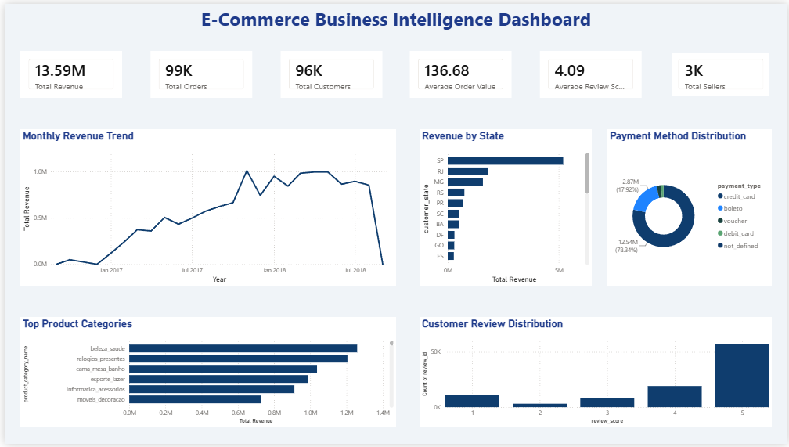
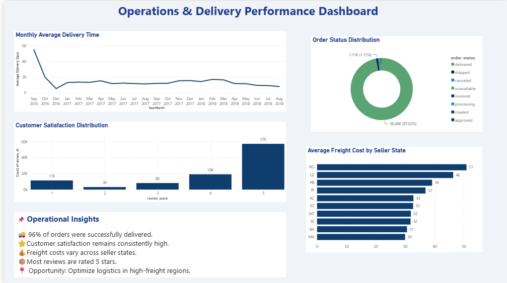
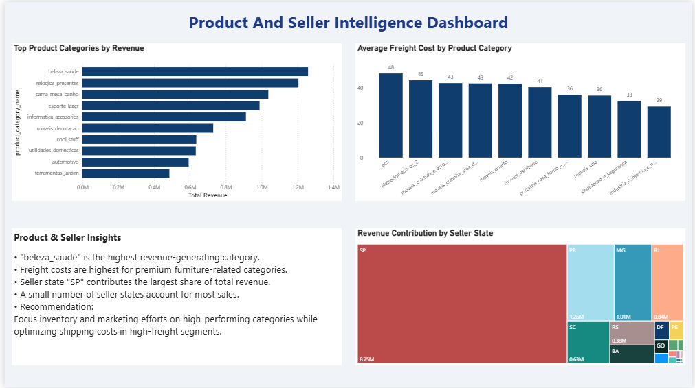

<h1 align="center">
E-Commerce Business Intelligence Dashboard
</h1>


## Overview

This project is an end-to-end Business Intelligence solution built using **Python** and **Power BI** on the **Brazilian Olist E-Commerce Dataset**.

The project follows a complete analytics workflow—from data preprocessing and exploratory data analysis (EDA) to interactive dashboard development and business insight generation.

---

## Tech Stack

- Python
- Pandas
- Matplotlib
- Jupyter Notebook
- Power BI Desktop
- DAX
- Power BI Relationships

---

## Project Workflow

```text
Brazilian Olist Dataset
        │
        ▼
Data Cleaning & Preprocessing
        │
        ▼
Exploratory Data Analysis (EDA)
        │
        ▼
Processed CSV Files
        │
        ▼
Power BI Data Modeling
        │
        ▼
DAX Measures
        │
        ▼
Interactive Dashboards
        │
        ▼
Business Insights
```

---

# Dashboard

##  Executive Dashboard

Provides a high-level overview of business performance, revenue trends, customer metrics, and sales KPIs.

**Highlights**

- Revenue Overview
- Customer Overview
- Monthly Revenue Trend
- Product Category Performance
- Payment Analysis
- Customer Review Analysis

<p align="center">
  
</p>

---

##  Operations & Delivery Dashboard

Focuses on operational efficiency, delivery performance, freight costs, and customer satisfaction metrics.

**Highlights**

- Delivery Performance
- Order Status Distribution
- Freight Cost Analysis
- Customer Satisfaction
- Operational Insights

<p align="center">
  
</p>

---

##  Product & Seller Intelligence Das
Analyzes product performance, seller contribution, freight costs, and category-level business insights.

**Highlights**

- Top Product Categories
- Freight Cost by Category
- Revenue Contribution by Seller State
- Product & Seller Insights

<p align="center">
  
</p>

---

## Exploratory Data Analysis (EDA)

The notebook includes visualizations for:

- Monthly Revenue Trend
- Monthly Orders Trend
- Top Revenue States
- Top Product Categories
- Order Status Distribution
- Payment Method Distribution
- Customer Review Distribution

**(Insert EDA screenshots here if desired)**

---

## Project Structure

```text
Customer-Intelligence-Revenue-Analytics/
│
├── assets/
│   ├── dashboard/
│   └── eda/
│
├── data/
│   ├── raw/
│   └── processed/
│
├── notebooks/
│
├── powerbi/
│
├── reports/
│
├── README.md
├── requirements.txt
└── .gitignore
```

---

## Key Business Insights

- Revenue is concentrated within a small number of product categories.
- Most customers provided positive (5-star) reviews.
- Credit Card is the most preferred payment method.
- Delivery performance remained stable throughout the observed period.
- Freight costs vary significantly across product categories.
- Seller performance differs considerably across different states.

---

## Installation

Clone the repository:

```bash
git clone https://github.com/kavya180/Customer-Intelligence-Revenue-Analytics.git
```

Install dependencies:

```bash
pip install -r requirements.txt
```

Run the notebook:

```text
notebooks/01_Data_Preprocessing_and_EDA.ipynb
```

Open the Power BI report:

```text
powerbi/Customer_Intelligence_Revenue_Analytics.pbix
```

---

## Future Improvements

- Customer Segmentation (RFM Analysis)
- Sales Forecasting
- Real-Time Dashboard Integration
- Customer Lifetime Value Prediction
- Drill-through Reports

---

## Author

### Kavya Kalathiya

Computer Engineering Student

GitHub: https://github.com/kavya180

LinkedIn: https://www.linkedin.com/in/kavya-kalathiya-ba7b10348

---

⭐ If you found this project useful, consider giving it a star.